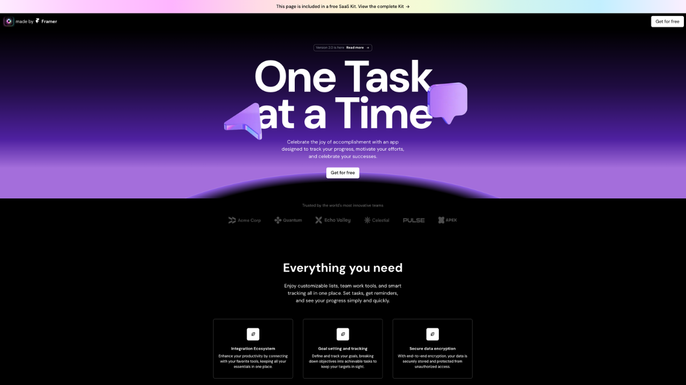

    

<h1 align="center" style="color:white;">
SaaS Landing Page
</h1>

A front-end application that allows users to explore SaaS product details.

<a style="text-decoration:underline;" href="https://sass-landing-page-jl.netlify.app/">Live site</a>
<h2 style="color:white;">
Developer Information
</h2>

Joseph Lang

<a href="https://www.linkedin.com/in/jlang67/" style="text-decoration:underline;">Linkedin</a>
<a href="https://github.com/joseph-lang7" style="text-decoration:underline;">Github</a>

